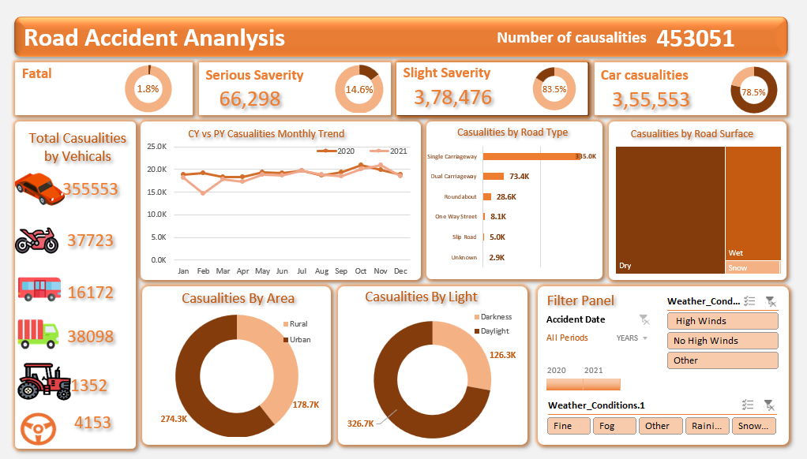

# Road Accident Analysis Dashboard

## Project Overview
This project analyzes road accident casualties data to identify patterns in accident severity,
vehicle involvement, road conditions, lighting, weather, and area type using an interactive dashboard.

## Objectives
- Understand accident severity distribution
- Identify high-risk vehicle types and road types
- Analyze trends over time
- Support data-driven road safety insights

## screenshot here

## Tools & Technologies 
- Power Query (ETL & data cleaning)
- DAX (KPIs & measures)
- Excel / CSV dataset

## Key Insights
- Total casualties: 453,051
- Cars account for the highest number of casualties
- Single carriageways are the most accident-prone road type
- Most accidents occur in daylight and dry road conditions
- Urban areas report more casualties than rural areas

## Author
Prem – Aspiring Data Analyst
